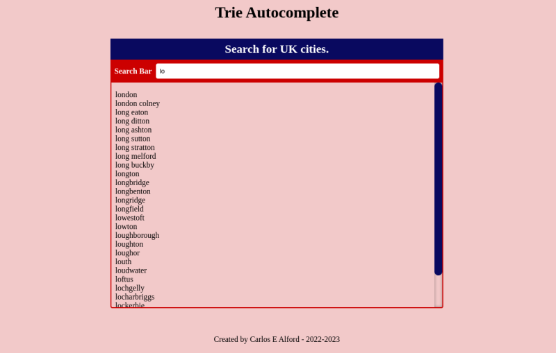
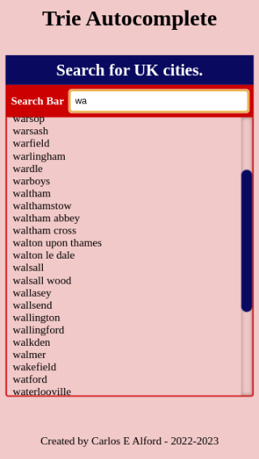

# Trie Autocomplete

Auto complete input box which uses the Trie Tree Data Structure a.k.a. prefix tree.


## Features

- Auto completion box


## Demo

The demo loads over 2,000 UK cities for you to search through. Currently it just displays the city name.

[Live demo](https://webshuriken.github.io/trie-autocomplete/)


## Screenshots






## Run Locally

Clone the project

```bash
  git clone https://github.com/webshuriken/trie-autocomplete
```

Go to the project directory

```bash
  cd my-project
```

Install dependencies

```bash
  npm install
```

Start the server

```bash
  npm run start
```


## Running Tests

To run tests, run the following command

```bash
  npm test
```


## Run Developer mode

To start developing which run a local server that reloads the browser when a file changes and also runs sass in the background so it automatically recompiles CSS on file save.

```bash
  npm run dev
```


## Color Reference

| Color             | Hex                                                                |
| ----------------- | ------------------------------------------------------------------ |
| Example Color |  #0a192f |
| Example Color |  #f8f8f8 |
| Example Color |  #00b48a |
| Example Color |  #00d1a0 |


## Tech Stack

**Client:** HTML, CSS, JavaScript

**Backend:** http-server


## Road Map

- Improve the suggestions
  
  1. Give the user a choice of the max number of results to display
  2. A way to keep track of the popular words and display them instead
  3. Improve storage of word 


## Key Takeaways

Learning about trie tree (a.k.a. prefix tree) was really interesting. When first reading about how it works and its purpose, the whole approach made sense. Then it came time to implement it and this is when you realise that you may not know as much as you thought. I took to the whiteboard to visualise how it is store and from there work out how to actually store new item and then how to retrieve them.

When I was implementing the search method for the tree a bug creeped up towards the end and during the search for said bug I realised that the search function could be improved if I used recursion. Good news, it worked and I actually implemented it faster than the first time around, which means I understand trie trees better.

For the auto-complete part of the program, I had to go back to the white board because it helps me to better visualise what is going on with the code. During the thinking stage I realised that using a similar approach to the search method could be a good call. I tried it and with the beauty of closure the auto-complete method was complete.


## Acknowledgements

 - [Kyle Simpson Trie Tree](https://frontendmasters.com/courses/algorithms-practice/trie-tree-data-structure/). I did not watch this frontend Masters course but I did attend a talk of his where he when through this topic.
 - [Mozilla debeloper resources](https://developer.mozilla.org/en-US/). Always super handy.
 - [SASS documentation](https://sass-lang.com/). Fantastic idea.
 - [Sarah Cope @ CSS Tricks](https://css-tricks.com/almanac/properties/s/scrollbar/). Article on scrollbar styling.


## Authors

- [Carlos E Alford](https://carlosealford.com/)


## License

[MIT](https://choosealicense.com/licenses/mit/)


